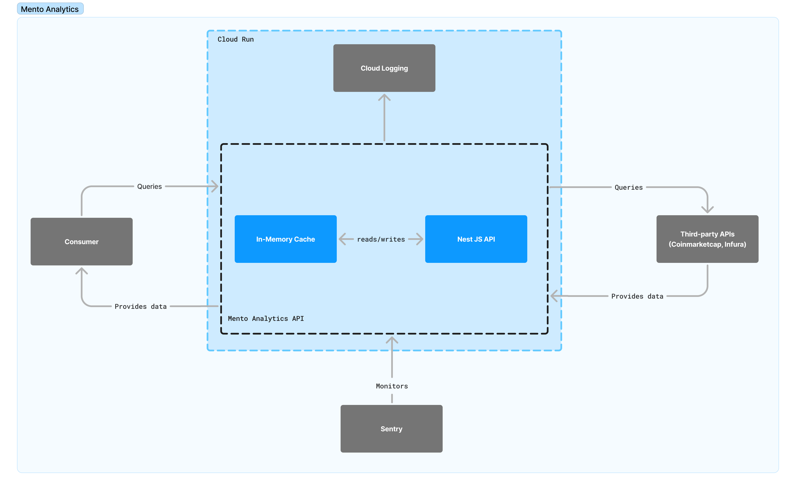

# Mento Analytics API

The Mento Analytics API is a service designed to provide real-time analytics for the Mento Protocol's stablecoins and reserve assets across multiple blockchains (Celo, Ethereum, and Bitcoin). It serves as the data backbone for the Mento Reserve dashboard, offering insights into reserve holdings and stablecoin metrics.

The API can be used by consumers to fetch information about the Mento Stables, the Reserve and it's composition.

## Getting Started

### Prerequisites

- Node.js (v21+)
- pnpm

### Installation

```bash
# Install dependencies
pnpm install

# Start development server
pnpm run start:dev

# Build for production
pnpm run build

# Start production server
pnpm run start:prod
```

### Environment Variables

Create a `.env` file in the root directory:

``` bash
cp .env.example .env
```

You'll need to obtain API keys for the Coinmarket cap & exchange rates API then add them to your env file

### CORS Configuration

The API is configured to accept requests from the Mento website. By default, it allows requests from:

- `https://mento.org`
- `https://www.mento.org`

To configure additional origins (e.g., for development), set the `CORS_ORIGINS` environment variable:

```bash
# Single origin
CORS_ORIGINS=https://mento.org

# Multiple origins (comma-separated)
CORS_ORIGINS=http://localhost:3000,https://mento.org,https://www.mento.org
```

## Key Features

- **Stablecoin Analytics:** Tracks the total supply of all Mento stables
- **Multi-Chain Reserve Tracking:** Monitors reserve assets across Celo, Ethereum and Bitcoin networks
- **Reserve Composition Analysis:** Detailed breakdown of reserve holdings and their USD values
- **Collateralization Metrics**: Real-time tracking of reserve-to-stablecoin ratios
- **Automated Cache Management**: Optimized data delivery with cache warming
- **Health Monitoring**: System health checks across all integrated services

## Project Structure

Below is the project structure:

```bash
src/
├── app.module.ts            # Root module
├── main.ts                  # Entry point
├── api/                     # API features
│   ├── stablecoins/         # Stablecoin-related endpoints
│   ├── reserve/             # Reserve-related endpoints
│   └── health/              # Health check endpoints
├── common/                      
│   └── services/            # Shared services   
├── types/                   # Shared types/interfaces
└── utils/                   # Utility functions
```

## System Architecture

The Mento Analytics API is hosted on Google Cloud Platform (GCP) using Cloud Run with logging handled by Cloud Logging. The diagram below illustrates the high-level architecture and data flow:



## API Documentation

Detailed documentaion for the API endpoints is available at `/docs` when running the application.

## Data Sources & Updates

### Data Sources

- On-chain data from multiple networks:
  - Celo: Mento SDK beta + Infura
  - Ethereum: Mento SDK beta + Infura
  - Bitcoin: Blockchain.info & Blockstream
- Price feeds: CoinmarketCap API for real-time asset pricing
- Exchange rate data: API Layer exchange rates API

### Data Update Frequency

Data provided by the API will be < 1 hour old. Data is only updated on an hourly schedule.

### Cache Management

The API implements a cache warming strategy to ensure data availability:

1. Initial warmup on service start
2. Scheduled refreshes every hour
3. Manual invalidation via admin endpoints - To Be Added

## Configuration Guide

### Adding New Stablecoins

Stablecoins are fetched directly from the blockchain using the Mento SDK. Additional information is requred for the price and image.

1. Add a fiat ticker for the stablecoin in the [SDK repo](https://github.com/mento-protocol/mento-sdk/blob/7656050794eef5609193cbafd53ea23f04df4d09/src/constants/stableTokenMetadata.ts#L13)
2. Publish the new sdk package version and update the verion in the API repo
3. Add an svg image for the stablecoin to the [tokens directory](https://github.com/mento-protocol/mento-analytics-api/tree/main/public/tokens), ensuring the filename matches the symbol.
4. Deploy changes and verify in `/stablecoins` endpoint

### Managing Reserve Addresses

1. Update addresses in `api/reserve/config/addresses.config.ts`
2. Deploy changes and verify in `/reserve` endpoints

### Adding Reserve Assets

Reserve assets are fetched directly from the blockchain using the Mento SDK. However the metadata is needed to enrich the data. This is hardcoded to reduce the number of external calls.

1. Add asset configuration to `api/reserve/config/assets.config.ts`
2. Deploy changes and verify in `/reserve` endpoints

## Deployment

The Mento Analytics API is automatically deployed to Google Cloud Run when changes are committed to the `main` branch.

### Deployment Process

1. When code is pushed or merged to the `main` branch, a CI/CD pipeline is triggered
2. The pipeline builds a Docker container using the Dockerfile in the repository
3. The container is pushed to Google Container Registry
4. The new container is deployed to Cloud Run, replacing the previous version
5. Deployment status can be monitored in the Google Cloud Console

## Monitoring & Logs

### Application Logs

- Get logs from the command line: `npm run logs` (which is just a shortcut for `./bin/get-logs.sh`)
- GCP Cloud Logging: [View Logs](https://console.cloud.google.com/run/detail/us-central1/mento-analytics-api/logs?invt=AbmVMA&project=mento-prod)
- Log levels:
  - INFO: Regular operation events
  - WARN: Potential issues requiring attention
  - ERROR: Critical issues affecting operation
  - DEBUG: Detailed information for development

### Monitoring Dashboard

- System metrics: [Cloud Monitoring](https://console.cloud.google.com/run/detail/us-central1/mento-analytics-api/metrics?invt=AbmVMA&project=mento-prod)
- Sentry error tracking: [View Issues](https://mento-labs.sentry.io/issues/?project=4508518701268992&statsPeriod=14d)
- Health checks: `/health` endpoint

## Contributing

1. Fork the repository
2. Create your feature branch (`git checkout -b feature/amazing-feature`)
3. Commit your changes (`git commit -m 'Add some amazing feature'`)
4. Push to the branch (`git push origin feature/amazing-feature`)
5. Open a Pull Request

## License

This project is licensed under the MIT License - see the [LICENSE](LICENSE) file for details.
